# ERD — База данных «СОКОЛ»

> Версия 1.0 | PostgreSQL + SQLAlchemy

---

## 1. Общая схема данных

```mermaid
erDiagram
    %% ===== АВТОРИЗАЦИЯ И ПОЛЬЗОВАТЕЛИ =====
    users {
        uuid id PK
        string email UK
        string phone UK
        string password_hash
        string first_name
        string last_name
        string middle_name
        string avatar_url
        boolean is_active
        timestamp created_at
        timestamp updated_at
        timestamp deleted_at
    }

    roles {
        uuid id PK
        string code UK
        string name
        string description
        boolean is_system
        timestamp created_at
    }

    permissions {
        uuid id PK
        string code UK
        string name
        string resource
        string action
        timestamp created_at
    }

    role_permissions {
        uuid role_id FK
        uuid permission_id FK
    }

    user_roles {
        uuid user_id FK
        uuid role_id FK
    }

    %% ===== ОРГАНИЗАЦИОННАЯ СТРУКТУРА =====
    regions {
        uuid id PK
        string name
        string code UK
        timestamp created_at
    }

    centers {
        uuid id PK
        string name
        uuid region_id FK
        string address
        string phone
        string email
        boolean is_active
        timestamp created_at
        timestamp updated_at
    }

    %% ===== СПОРТСМЕНЫ =====
    athletes {
        uuid id PK
        string first_name
        string last_name
        string middle_name
        date birth_date
        string gender
        string photo_url
        uuid center_id FK
        uuid coach_id FK
        string sport_type
        string rank
        date rank_assign_date
        string rank_order_number
        string status
        text notes
        timestamp created_at
        timestamp updated_at
    }

    athlete_documents {
        uuid id PK
        uuid athlete_id FK
        string doc_type
        string doc_number
        date issue_date
        date expire_date
        string file_url
        boolean is_verified
        uuid verified_by FK
        timestamp created_at
    }

    athlete_medical {
        uuid id PK
        uuid athlete_id FK
        string medical_type
        date examination_date
        date valid_until
        string diagnosis
        string doctor_name
        string file_url
        boolean is_approved
        timestamp created_at
    }

    athlete_ranks_history {
        uuid id PK
        uuid athlete_id FK
        string rank_before
        string rank_after
        date assign_date
        string order_number
        string file_url
        timestamp created_at
    }

    athlete_achievements {
        uuid id PK
        uuid athlete_id FK
        uuid competition_id FK
        string achievement_type
        string place
        string medal
        date date
        string description
        string file_url
        timestamp created_at
    }

    %% ===== ТРЕНЕРЫ =====
    coaches {
        uuid id PK
        uuid user_id FK
        uuid center_id FK
        string specialization
        string qualification
        string biography
        date hire_date
        boolean is_active
        timestamp created_at
        timestamp updated_at
    }

    coach_categories {
        uuid id PK
        uuid coach_id FK
        string category_name
        date certified_at
        date valid_until
        string document_url
        timestamp created_at
    }

    %% ===== ТРЕНИРОВОЧНЫЙ ПРОЦЕСС =====
    groups {
        uuid id PK
        string name
        uuid center_id FK
        uuid coach_id FK
        string sport_type
        string age_group
        string skill_level
        integer max_capacity
        text schedule_note
        boolean is_active
        timestamp created_at
        timestamp updated_at
    }

    group_members {
        uuid group_id FK
        uuid athlete_id FK
        date join_date
        date leave_date
        boolean is_active
    }

    schedules {
        uuid id PK
        uuid group_id FK
        uuid center_id FK
        uuid coach_id FK
        string day_of_week
        time start_time
        time end_time
        string location
        string room
        timestamp created_at
        timestamp updated_at
    }

    attendance {
        uuid id PK
        uuid athlete_id FK
        uuid schedule_id FK
        uuid group_id FK
        date date
        string status
        time check_in_time
        string absence_reason
        string check_in_method
        uuid checked_by FK
        timestamp created_at
    }

    attendance_qr_codes {
        uuid id PK
        uuid schedule_id FK
        string qr_code
        date valid_date
        time valid_from
        time valid_until
        boolean is_active
        timestamp created_at
    }

    %% ===== СОРЕВНОВАНИЯ =====
    events {
        uuid id PK
        string name
        string event_type
        uuid center_id FK
        uuid organizer_id FK
        date start_date
        date end_date
        string location
        string description
        string status
        timestamp created_at
        timestamp updated_at
    }

    competitions {
        uuid id PK
        uuid event_id FK
        string name
        string discipline
        string age_group
        string gender
        string weight_category
        string competition_type
        integer max_participants
        string status
        timestamp created_at
    }

    participants {
        uuid id PK
        uuid competition_id FK
        uuid athlete_id FK
        string status
        integer seed
        string weight_at_registration
        timestamp registered_at
    }

    results {
        uuid id PK
        uuid competition_id FK
        uuid athlete_id FK
        uuid participant_id FK
        string stage
        integer position
        string score
        string result_value
        string medal
        text notes
        timestamp created_at
    }

    %% ===== ОТЧЕТНОСТЬ =====
    report_templates {
        uuid id PK
        string name
        string code UK
        string report_type
        text structure_json
        text description
        boolean is_active
        timestamp created_at
        timestamp updated_at
    }

    reports {
        uuid id PK
        uuid template_id FK
        uuid author_id FK
        uuid center_id FK
        uuid coach_id FK
        string period_type
        date period_start
        date period_end
        text data_json
        string status
        uuid reviewer_id FK
        text review_comment
        date reviewed_at
        timestamp created_at
        timestamp updated_at
    }

    report_submissions {
        uuid id PK
        uuid report_id FK
        uuid submitted_by FK
        string status
        text comment
        timestamp created_at
    }

    %% ===== ДОКУМЕНТООБОРОТ =====
    document_templates {
        uuid id PK
        string name
        string code UK
        string doc_type
        text template_fields_json
        boolean is_active
        timestamp created_at
    }

    documents {
        uuid id PK
        uuid template_id FK
        uuid author_id FK
        text content_json
        string status
        string file_url
        timestamp created_at
        timestamp updated_at
    }

    document_approvals {
        uuid id PK
        uuid document_id FK
        uuid approver_id FK
        string action
        text comment
        integer step_order
        timestamp created_at
    }

    %% ===== VK MINI APP =====
    vk_users {
        uuid id PK
        uuid user_id FK
        integer vk_user_id UK
        string vk_access_token
        string platform
        boolean is_verified
        timestamp created_at
        timestamp updated_at
    }

    vk_notifications {
        uuid id PK
        uuid user_id FK
        string notification_type
        string title
        text message
        boolean is_read
        boolean is_sent
        timestamp sent_at
        timestamp read_at
        timestamp created_at
    }

    %% ===== АУДИТ =====
    audit_logs {
        uuid id PK
        uuid user_id FK
        string action
        string resource
        string resource_id
        text old_value
        text new_value
        string ip_address
        string user_agent
        timestamp created_at
    }

    %% ===== СВЯЗИ =====
    users ||--o{ user_roles : has
    roles ||--o{ user_roles : has
    roles ||--o{ role_permissions : has
    permissions ||--o{ role_permissions : has

    regions ||--o{ centers : contains

    centers ||--o{ athletes : trains
    coaches ||--o{ athletes : coaches

    users ||--o{ coaches : is
    centers ||--o{ coaches : employs

    athletes ||--o{ athlete_documents : has
    athletes ||--o{ athlete_medical : has
    athletes ||--o{ athlete_ranks_history : has
    athletes ||--o{ athlete_achievements : has

    coaches ||--o{ groups : leads
    centers ||--o{ groups : hosts
    groups ||--o{ group_members : includes
    athletes ||--o{ group_members : belongs_to

    groups ||--o{ schedules : has
    schedules ||--o{ attendance : tracks
    athletes ||--o{ attendance : records
    schedules ||--o{ attendance_qr_codes : generates

    centers ||--o{ events : organizes
    events ||--o{ competitions : includes
    competitions ||--o{ participants : registers
    athletes ||--o{ participants : participates
    competitions ||--o{ results : produces
    athletes ||--o{ results : achieves
    report_templates ||--o{ reports : defines
    users ||--o{ reports : authors
    centers ||--o{ reports : belongs_to
    reports ||--o{ report_submissions : workflow

    document_templates ||--o{ documents : defines
    users ||--o{ documents : authors
    documents ||--o{ document_approvals : approved_by
    users ||--o{ document_approvals : approves

    users ||--o{ vk_users : connects
    users ||--o{ vk_notifications : notifies
    users ||--o{ audit_logs : logs
```



---

## 2. Описание таблиц

### 2.1 Авторизация и пользователи

| Таблица | Назначение | Ключевые поля |
|---------|-----------|---------------|
| `users` | Все пользователи системы | email, phone, password_hash, ФИО |
| `roles` | Роли (админ, тренер, руководитель...) | code, name |
| `permissions` | Права доступа (ресурс + действие) | code, resource, action |
| `role_permissions` | Связь ролей и прав | role_id → roles, permission_id → permissions |
| `user_roles` | Связь пользователей и ролей | user_id → users, role_id → roles |

### 2.2 Организационная структура

| Таблица | Назначение | Ключевые поля |
|---------|-----------|---------------|
| `regions` | Регионы/области | name, code |
| `centers` | Клубы/центры/филиалы | name, region_id, address |
### 2.3 Спортсмены

| Таблица | Назначение | Ключевые поля |
|---------|-----------|---------------|
| `athletes` | Основная карточка спортсмена | ФИО, дата рождения, разряд, центр, тренер |
| `athlete_documents` | Документы (медсправки, страховки) | athlete_id, doc_type, срок действия |
| `athlete_medical` | Медицинские осмотры | athlete_id, тип осмотра, диагноз, срок действия |
| `athlete_ranks_history` | История присвоения разрядов | athlete_id, rank_before, rank_after, номер приказа |
| `athlete_achievements` | Достижения (турниры, медали) | athlete_id, competition_id, место, медаль |

### 2.4 Тренеры

| Таблица | Назначение | Ключевые поля |
|---------|-----------|---------------|
| `coaches` | Тренерские карточки | user_id → users, center_id, специализация, квалификация |
| `coach_categories` | Категории тренеров | coach_id, категория, срок действия |

### 2.5 Тренировочный процесс

| Таблица | Назначение | Ключевые поля |
|---------|-----------|---------------|
| `groups` | Тренировочные группы | name, coach_id, center_id, возраст, уровень |
| `group_members` | Состав групп | group_id, athlete_id, дата вступления |
| `schedules` | Расписание занятий | group_id, день недели, время, место |
| `attendance` | Посещаемость | athlete_id, schedule_id, дата, статус, причина |
| `attendance_qr_codes` | QR-коды для отметок | schedule_id, код, срок действия |

### 2.6 Соревнования и мероприятия

| Таблица | Назначение | Ключевые поля |
|---------|-----------|---------------|
| `events` | Мероприятия (турниры, сборы) | name, тип, даты, место, статус |
| `competitions` | Пул соревнований внутри мероприятия | event_id, дисциплина, вес, статус |
| `participants` | Участники соревнования | competition_id, athlete_id, статус, вес |
| `results` | Результаты выступлений | competition_id, athlete_id, место, очки, медаль |

### 2.7 Отчетность

| Таблица | Назначение | Ключевые поля |
|---------|-----------|---------------|
| `report_templates` | Шаблоны отчетов | name, code, тип, структура (JSON) |
| `reports` | Сформированные отчеты | template_id, автор, центр, период, данные (JSON), статус |
| `report_submissions` | История отправок/согласований | report_id, автор, статус, комментарий |

### 2.8 Документооборот

| Таблица | Назначение | Ключевые поля |
|---------|-----------|---------------|
| `document_templates` | Шаблоны документов | name, тип, поля (JSON) |
| `documents` | Сгенерированные документы | template_id, автор, содержание (JSON), статус |
| `document_approvals` | Согласование документов | document_id, согласующий, действие, шаг |

### 2.9 VK Mini App
| Таблица | Назначение | Ключевые поля |
|---------|-----------|---------------|
| `vk_users` | Привязка VK ID к пользователю | user_id, vk_user_id, vk_access_token |
| `vk_notifications` | Уведомления | user_id, тип, сообщение, статус |

### 2.10 Аудит
| Таблица | Назначение | Ключевые поля |
|---------|-----------|---------------|
| `audit_logs` | Лог действий пользователей | user_id, action, resource, old_value, new_value, IP |

---

## 3. Типы данных (соглашения)

| Тип | Применение |
|-----|-----------|
| `uuid` | Все первичные ключи (PK) |
| `string (varchar)` | Названия, коды, ФИО |
| `text` | Длинные описания, JSON-структуры |
| `timestamp` | created_at, updated_at, deleted_at |
| `date` | Дата рождения, даты событий |
| `time` | Время занятий |
| `boolean` | Флаги (is_active, is_verified) |
| `integer` | vk_user_id |

### Naming conventions

- **Таблицы**: `snake_case`, множественное число (`athletes`, `groups`)
- **Поля**: `snake_case` (`first_name`, `birth_date`, `center_id`)
- **PK**: `id`
- **FK**: `{table}_id` (`user_id`, `athlete_id`)
- **Soft delete**: `deleted_at` (timestamp, nullable)
- **Timestamps**: `created_at`, `updated_at`
- **Статусы**: `string ENUM` через constraint

---

## 4. Индексы

| Таблица | Индекс | Обоснование |
|---------|--------|-------------|
| `users` | email, phone (UNIQUE) | Поиск при логине |
| `users` | last_name, first_name | Поиск по ФИО |
| `athletes` | center_id, coach_id | Фильтрация по центру/тренеру |
| `athletes` | last_name, first_name, birth_date | Поиск дубликатов |
| `attendance` | athlete_id, date | Журнал посещаемости |
| `attendance` | schedule_id, date | Отметка по расписанию |
| `reports` | author_id, period_start, period_end | История отчетов |
| `reports` | center_id, status | Фильтрация по центру/статусу |
| `audit_logs` | user_id, created_at | Аудит действий |
| `schedules` | group_id, day_of_week | Расписание групп |

---

## 5. Основные связи (business logic)

```
Центр (centers) ──has──> Группы (groups)
Центр (centers) ──has──> Спортсмены (athletes)
Центр (centers) ──has──> Тренеры (coaches)
Тренер (coaches) ──leads──> Группы (groups)
Тренер (coaches) ──coaches──> Спортсмены (athletes)
Группа (groups) ──includes──> Спортсмены (athletes)  [через group_members]
Группа (groups) ──has──> Расписание (schedules)
Расписание (schedules) ──tracks──> Посещаемость (attendance)
Пользователь (users) ──is──> Тренер (coaches)
Пользователь (users) ──authors──> Отчеты (reports)
Пользователь (users) ──authors──> Документы (documents)
```
